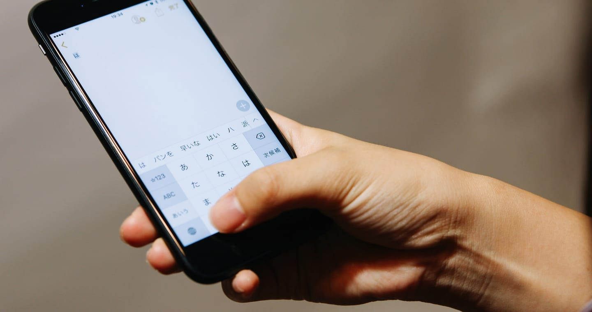

席次表の作り方には、大きく分けて 3 つの方法があります。自分たちで手作りする方法、会場や印刷業者にお願いする方法、そして最近増えてきた WEB 席次表です。

どれが正解ということはなく、おふたりが何を大切にしたいかで選び方が変わります。この記事では、それぞれの良いところと気をつけたいところを比べてみます。

## 手作りの席次表

自分たちでデザインを考えて、家のプリンターや印刷サービスで刷る方法です。

いちばんの魅力は、デザインを自由に決められることです。紙の種類や色、イラストまでこだわれるので、おふたりらしい席次表に仕上がります。テンプレートを使えば、費用も抑えやすくなります。

その代わり、手間と時間はかかります。デザインを作って、印刷して、折ってと、ゲストの人数分の作業が必要です。結婚式の直前は準備が重なる時期なので、余裕をもって進めないと大変になってしまいます。

## 会場や印刷業者にお願いする

結婚式場の提携先や、印刷業者にお願いする方法です。

用意されたデザインから選んで、名前や肩書きを入稿すれば、きれいに印刷されたものが届きます。仕上がりの質が安定していて、おふたりの手間も少ないのが良いところです。

気をつけたいのは、1 部ごとに費用がかかるので、ゲストが多いほど金額が大きくなることです。また、入稿の締め切りが結婚式の数週間前になることが多く、それ以降の変更は難しくなります。

## WEB 席次表

席次表をインターネット上に公開して、ゲストに自分のスマートフォンで見てもらう方法です。

いちばんの良いところは、直前の変更に強いことです。急な欠席で席替えが必要になっても、名前の間違いに気づいても、その場で直せばすぐにゲストの画面に反映されます。印刷がないので、入稿の締め切りに追われることもありません。

もうひとつは、ゲストの人数が増えても費用が変わりにくいことです。紙のように部数で費用が決まるわけではないので、大人数の結婚式ほど差が出やすくなります。

一方で、スマートフォンに慣れていないご年配のゲストには、見方がわかりにくいこともあります。紙の席次表を記念にとっておきたいという方もいるので、そこはおふたりのゲストの顔ぶれに合わせて考えたいところです。

## どう選べばいい？

デザインに思いきりこだわりたいなら、手作りが向いています。手間をかけずにきれいなものを用意したいなら、会場や業者にお願いするのが安心です。直前まで変更が出そうなときや、ゲストの人数が多いときは、WEB 席次表が力を発揮します。

組み合わせるのもひとつの方法です。たとえば WEB 席次表を基本にして、ご年配のゲストのために、席次表を印刷したものを受付に用意しておく、といった使い方もできます。

## envas でできること

WEB 席次表の envas は、席次表とおふたりのプロフィールブックを、ゲストのスマートフォンに届けるサービスです。料金は 9,800 円で、ゲストの人数にかかわらず変わりません。月額料金もなく、お支払いは一度だけです。

席次表の修正は結婚式の当日まで何度でもでき、追加の費用はかかりません。ゲストには、受付に置いた QR コードから席次表を見てもらえます。

スマートフォンに慣れていないゲストがいる場合も安心です。席次表を画像でダウンロードして印刷すれば、会場に貼り出すことができます。QR コードの入ったエスコートカードを印刷してお届けするオプションもあります。

席次表の編集とプレビューは無料なので、まずは気軽に作ってみてください。

[https://envas.jp/](https://envas.jp/)

席次表の画像のダウンロードについては、ヘルプページで紹介しています。

[https://help.envas.jp/seating-chart-image/](https://help.envas.jp/seating-chart-image/)
