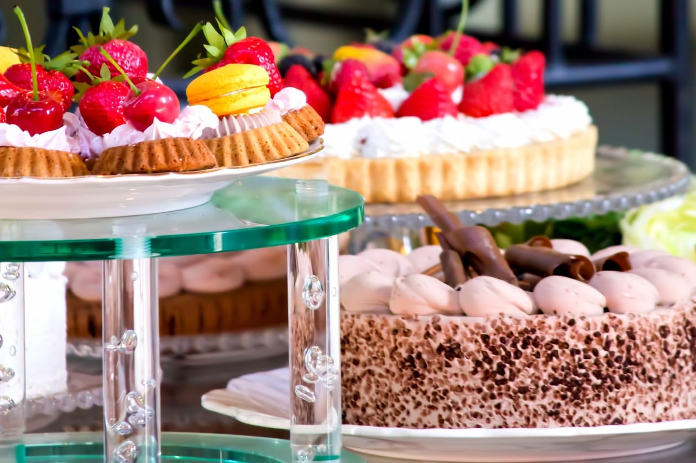
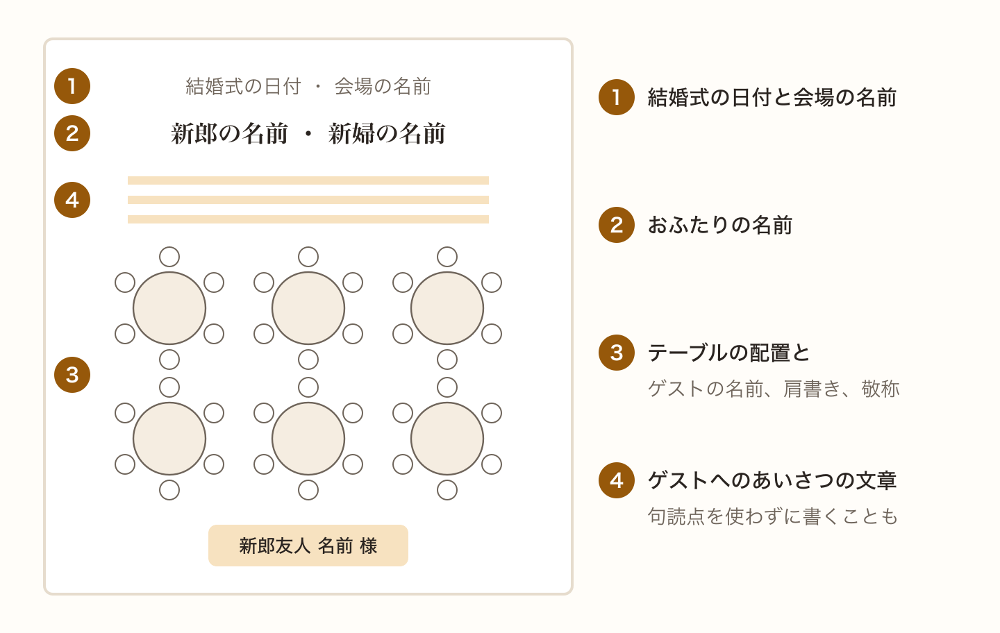
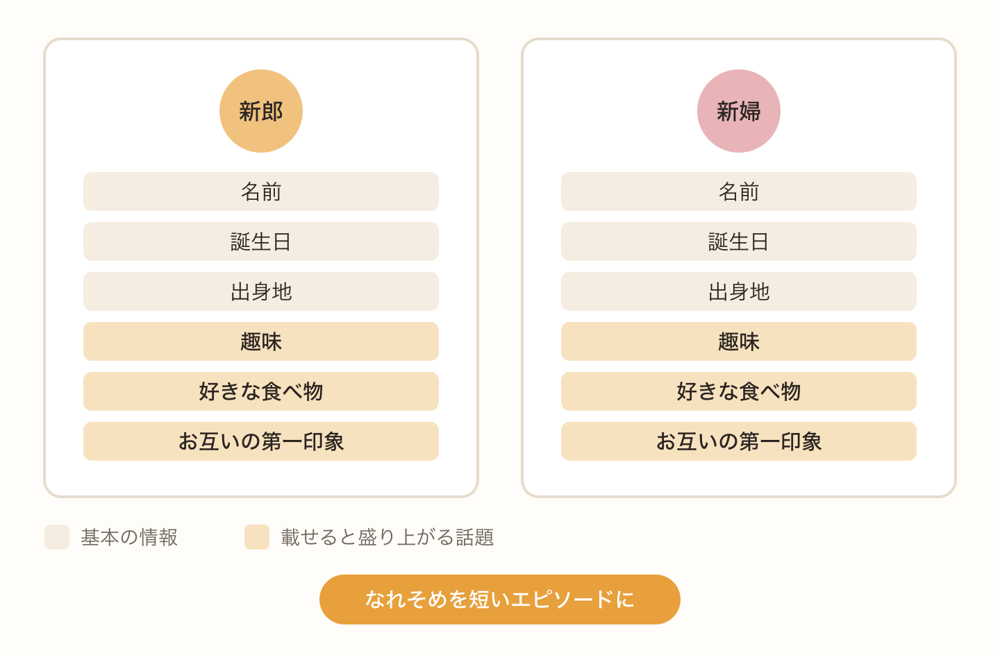
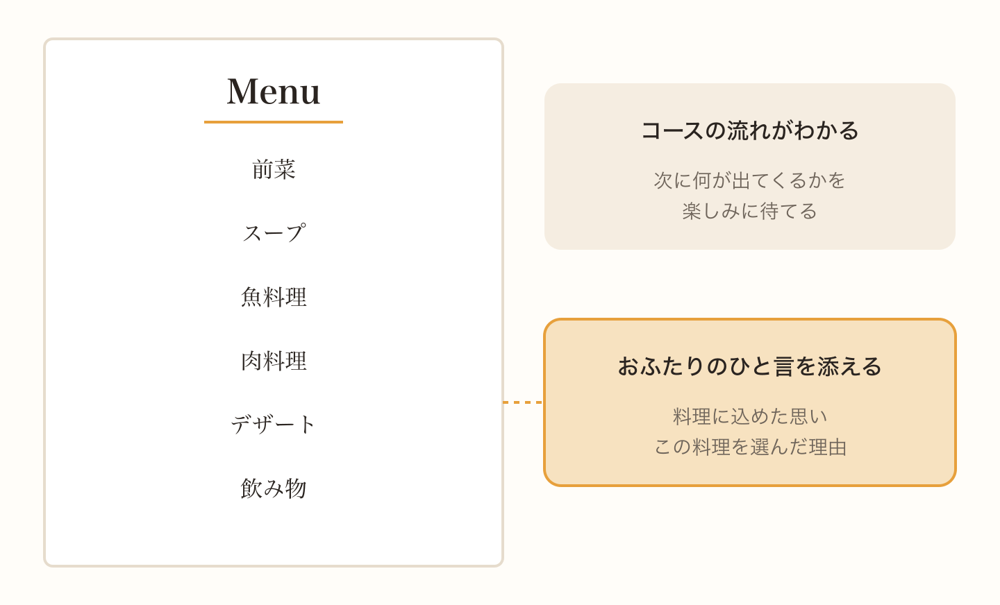
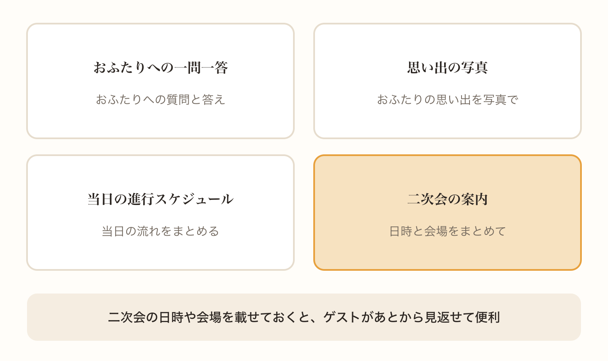
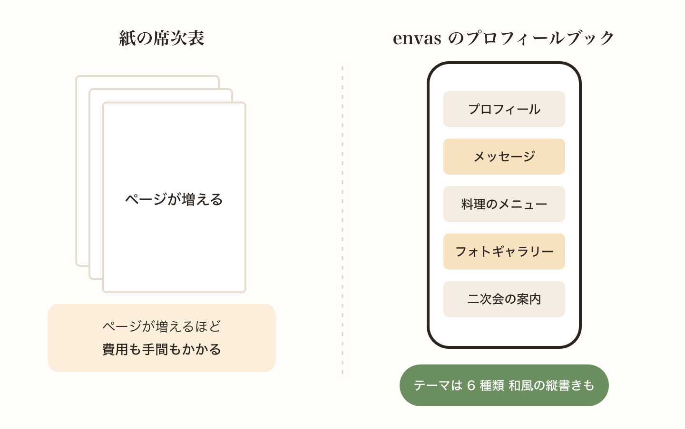

席次表は、ゲストに自分の席を伝えるためのものです。でも、それだけではもったいないと思いませんか。

披露宴が始まるまでの待ち時間や、歓談の時間に、ゲストは席次表をじっくり眺めています。おふたりのことを知ってもらえる内容を少し加えるだけで、会話も弾みやすくなります。

## 必ず載せたいこと

まずは、席次表として欠かせない内容です。

- 結婚式の日付と会場の名前
- おふたりの名前
- テーブルの配置と、ゲストの名前、肩書き、敬称
- ゲストへのあいさつの文章

あいさつの文章は、来てくれたことへのお礼を短く伝えるものです。お祝いの席の文章では、句読点を使わずにスペースや改行で区切るのが昔からの習わしとされています。気になる方は、あいさつ文だけでも句読点を使わずに書いてみてください。

## おふたりのプロフィール

ゲストの中には、新郎のことは知っていても新婦のことはよく知らない、という方もたくさんいます。おふたりのプロフィールがあれば、そんなゲストにも親しみをもってもらえます。

名前や誕生日、出身地のような基本の情報に加えて、趣味や好きな食べ物、お互いの第一印象などを載せると盛り上がります。おふたりのなれそめを短いエピソードにして載せるのも人気です。

## 料理と飲み物のメニュー

コース料理のメニューを載せておくと、ゲストは次に何が出てくるかを楽しみに待てます。料理に込めた思いや、おふたりが選んだ理由をひと言添えるのもすてきです。

## ちょっとした読みもの

ほかにも、こんな内容がよく選ばれています。

- おふたりへの一問一答
- おふたりの思い出の写真
- 当日の進行のスケジュール
- 二次会の案内

特に二次会の案内は、日時や会場をまとめて載せておくと、ゲストがあとから見返せて便利です。

## WEB なら写真も文章もたっぷり載せられる

紙の席次表は、ページ数が増えるほど費用も手間もかかります。載せたいことがたくさんあっても、泣く泣く削ることになりがちです。

envas では、席次表と一緒にプロフィールブックを作ってゲストに見てもらえます。プロフィールやメッセージ、料理のメニューに加えて、写真を並べたフォトギャラリーや二次会の案内も載せられます。

デザインは、シンプルなものから和紙の雰囲気をいかした和風のものまで、6 種類のテーマから選べます。和風のテーマには縦書きのものもあるので、和装の結婚式にもよく合います。

[https://help.envas.jp/profile-book-themes/](https://help.envas.jp/profile-book-themes/)

プロフィールの文章を考える時期については、こちらの記事でスケジュールと一緒に紹介しています。

[席次表の準備はいつから？結婚式までのスケジュールと進め方](/articles/2026-10-07-seating-chart-schedule/)
