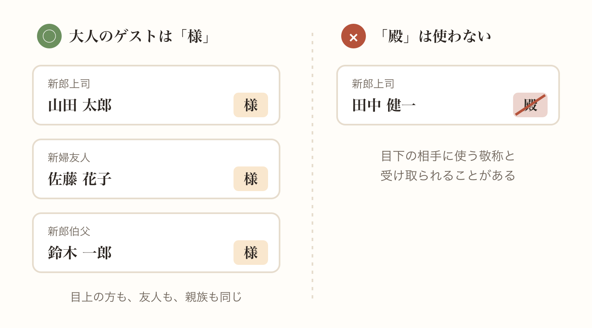
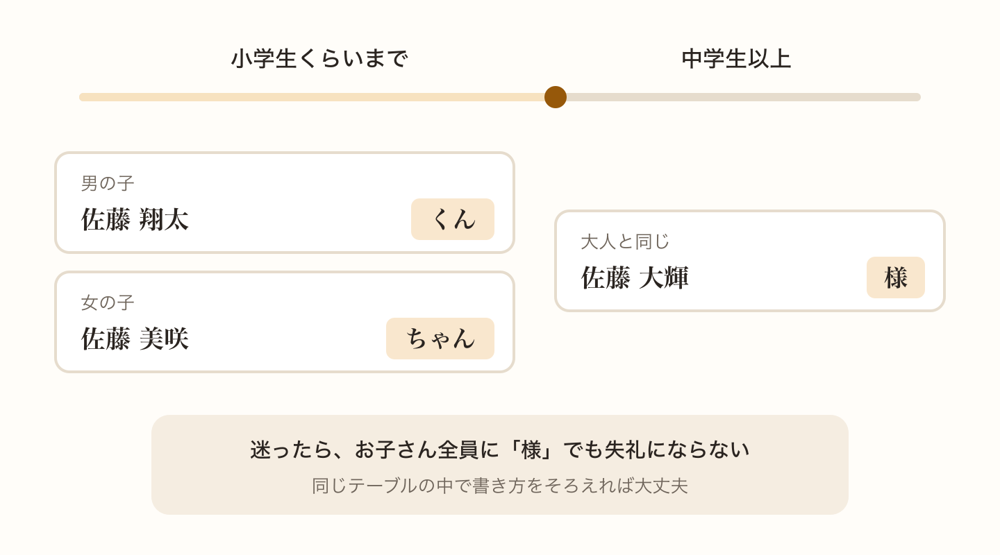
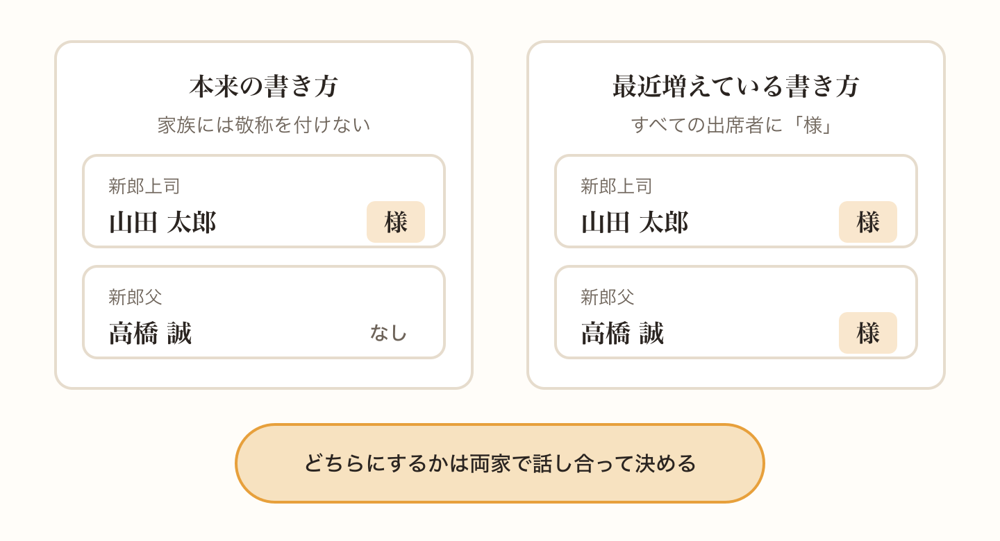
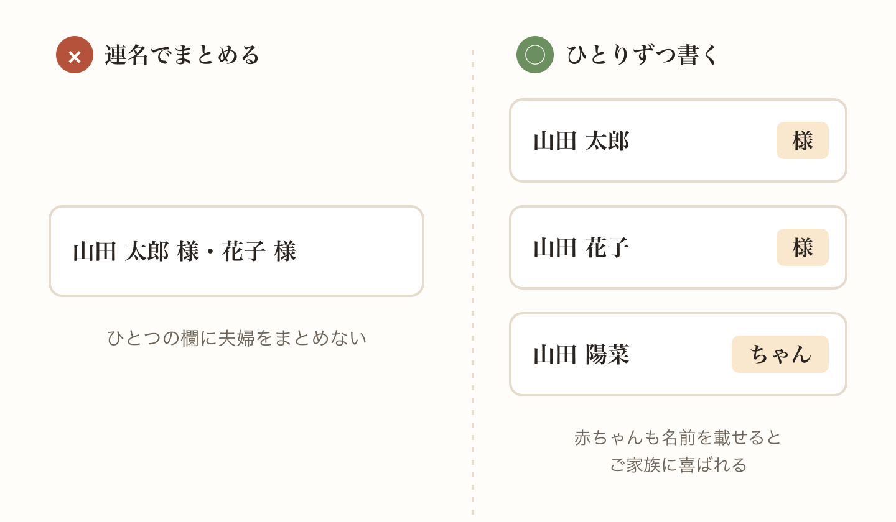
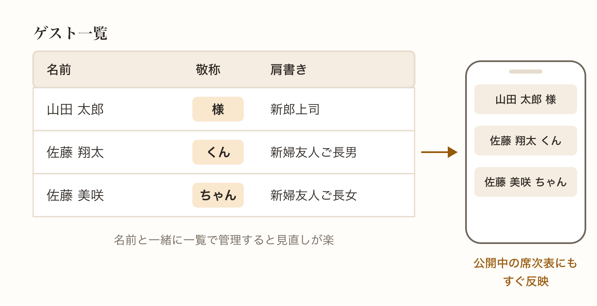

席次表では、ゲストの名前のあとに敬称を付けます。ほとんどのゲストは「様」で問題ありませんが、子どもや家族のことになると急に迷いが出てきます。

この記事では、敬称の基本と、相談の多いケースの書き方を紹介します。

## 大人のゲストは「様」が基本

職場の上司も、友人も、親族も、大人のゲストには「様」を付けます。目上の方だからといって特別な敬称を使う必要はありません。

手紙などで見かける「殿」は、目下の相手に使う敬称と受け取られることがあるので、席次表では使わないようにしましょう。

## 子どもは年齢で使い分ける

お子さんの敬称は、年齢で使い分けるのが一般的です。小学生くらいまでは男の子なら「くん」、女の子なら「ちゃん」を付けます。中学生以上なら、大人と同じ「様」にしておくと安心です。

迷ったときは、すべてのお子さんに「様」を付けてもまったく失礼にはなりません。同じテーブルの中で書き方がそろっていれば大丈夫です。

## 両親やきょうだいに敬称を付けるか

ここがいちばん意見の分かれるところです。席次表は、おふたりと両家がゲストをお招きするために作るものです。そのため本来は、おふたりの両親や同居している家族には敬称を付けないとされています。

一方で、最近はすべての出席者に「様」を付ける席次表も増えています。家族だけ敬称がないと、ほかのゲストに冷たい印象を与えるのではと気にするおふたりも多いようです。

どちらが正しいということはないので、両家で話し合って決めましょう。祖父母や親族の考え方もあるので、親に一度聞いてみるのがいちばん確実です。

## ご夫婦やご家族で招待するとき

ご夫婦で招待した場合は、それぞれの名前に「様」を付けます。連名でまとめるのではなく、ひとりずつ名前を書くのが席次表の基本です。

ご家族で招待した場合も同じで、お子さんも含めてひとりずつ名前を書き、それぞれに敬称を付けます。赤ちゃんの場合も「ちゃん」や「くん」を付けて名前を載せておくと、ご家族に喜ばれます。

## 敬称もゲストごとにまとめて管理しよう

敬称は、ゲストが増えるほど付け忘れや書き間違いが起こりやすくなります。名前と一緒に一覧で管理しておくと、最後の見直しが楽になります。

envas では、ゲストごとに名前、敬称、肩書きを登録できます。お子さんだけ「くん」や「ちゃん」にする、といった使い分けもゲスト一覧で済ませられます。公開したあとに敬称を直しても、その内容がすぐにゲストの見る席次表に反映されます。

[https://help.envas.jp/guest/](https://help.envas.jp/guest/)

名前の上に書く肩書きについては、こちらの記事で紹介しています。

[席次表の肩書きの書き方 上司や友人、親族ごとの例と迷いやすいケース](/articles/2026-10-07-seating-chart-titles/)
