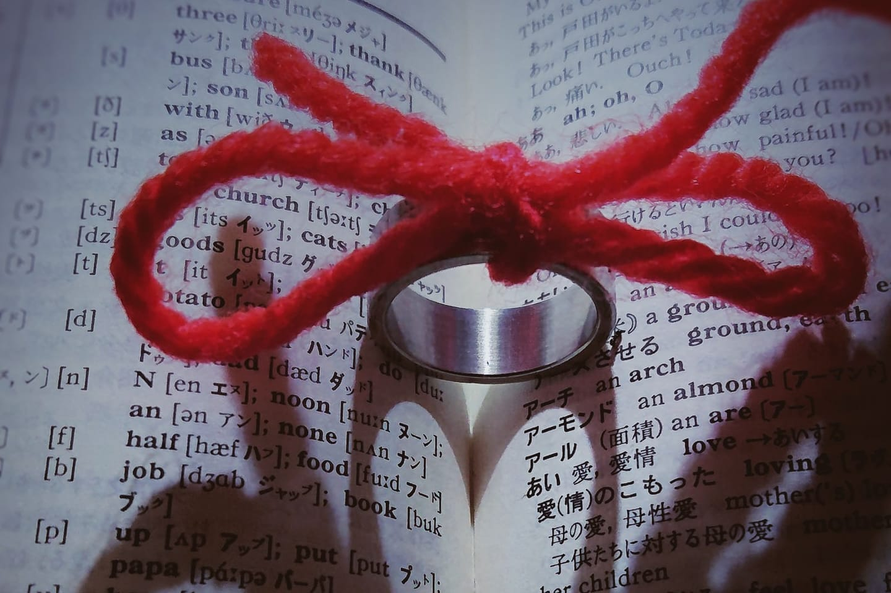
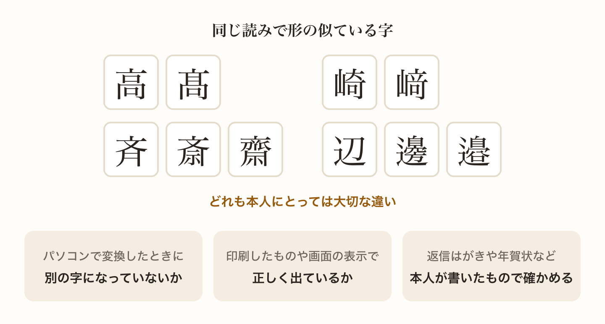
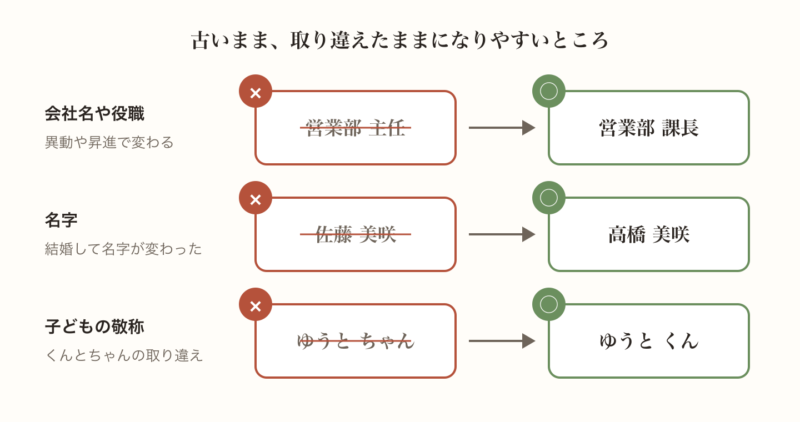
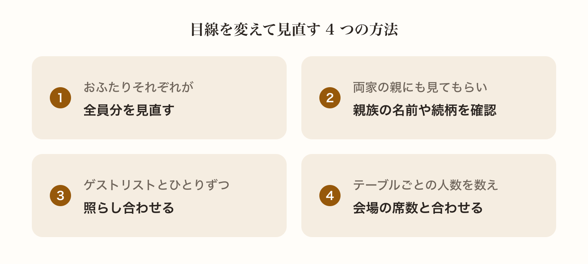
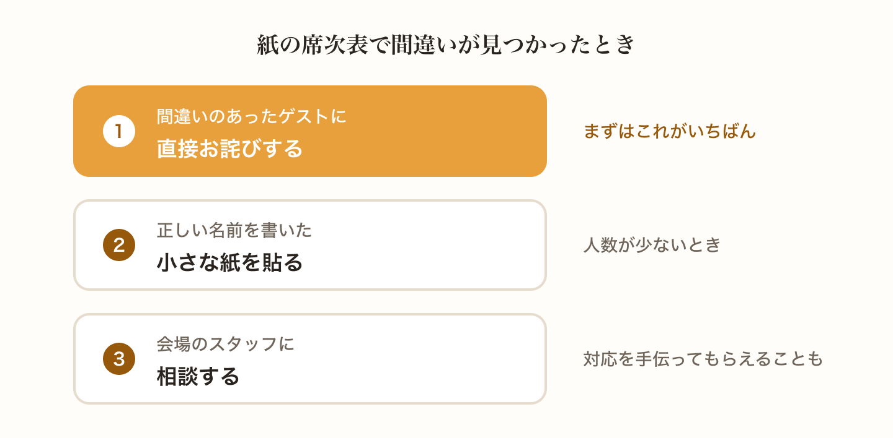
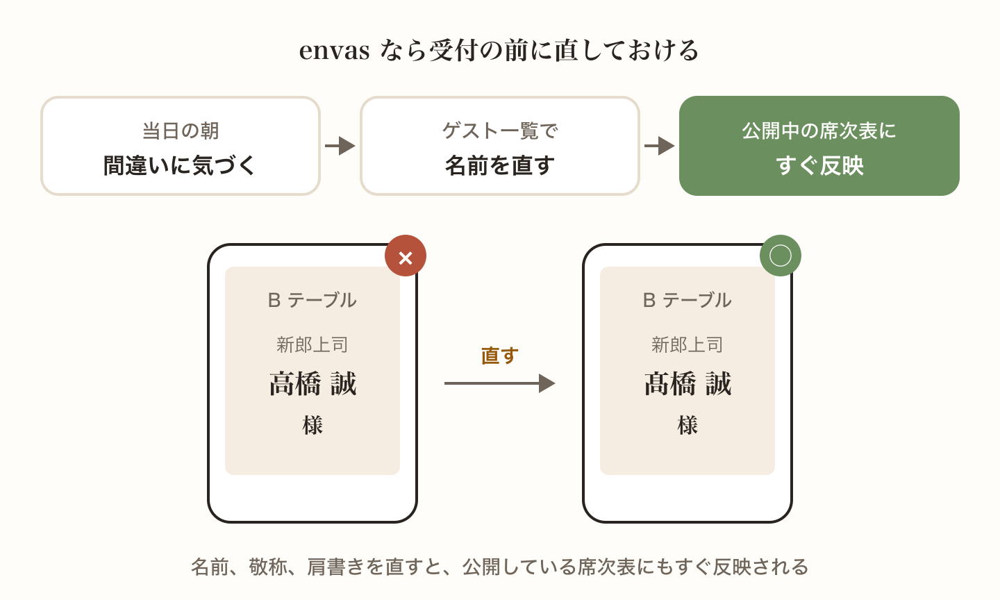

席次表は、ゲストが自分の名前を探して必ず目を通すものです。だからこそ、名前の漢字がひとつ違うだけでも気づかれてしまいます。

この記事では、席次表で間違えやすいポイントと、見直しのコツを紹介します。万が一、当日に間違いが見つかったときの対応もあわせてまとめました。

## 間違えやすいのは名前の漢字

いちばん多いのが名前の漢字の間違いです。特に気をつけたいのが、同じ読み方で形の似ている漢字です。

たとえば「高」と「髙」、「崎」と「﨑」、「斉」と「斎」と「齋」、「辺」と「邊」と「邉」のような字は、本人にとっては大切な違いです。パソコンで変換したときに別の字になっていないか、ひとつずつ確認しましょう。

字によっては、印刷するフォントや表示する端末で正しく出ないこともあります。気になる字があるときは、実際に印刷したものや画面に表示したもので確かめておくと安心です。

名前の確認には、招待状の返信はがきや年賀状など、ゲスト本人が書いたものを使うのが確実です。

## 肩書きや敬称の間違いも多い

名前の次に多いのが、肩書きの間違いです。会社名や部署名、役職は、異動や昇進で変わっていることがあります。職場のゲストについては、最新の名刺で確かめるか、同僚の方に確認しておきましょう。

結婚して名字が変わった友人や、転職したばかりの友人の情報も、古いままになりがちです。

敬称の付け忘れや、子どもの「くん」と「ちゃん」の取り違えにも気をつけましょう。

## 見直しのコツ

席次表は何度も見ているうちに、間違いに気づきにくくなっていきます。次のような方法で、目線を変えて見直すのがおすすめです。

- おふたりで分担せず、それぞれが全員分を見直す
- 両家の親にも見てもらい、親族の名前や続柄を確認してもらう
- ゲストリストとひとりずつ照らし合わせ、出席者が全員載っているかを確かめる
- テーブルごとの人数を数え、会場の席数と合っているかを確かめる

## 当日に間違いが見つかったら

どれだけ気をつけていても、当日に間違いが見つかることはあります。紙の席次表の場合、その場で刷り直すのは難しいので、まずは間違いのあったゲストに直接お詫びするのがいちばんです。

人数が少なければ、正しい名前を書いた小さな紙を貼って直すこともできます。会場のスタッフに相談すると、対応を手伝ってもらえることもあります。

## WEB 席次表ならその場で直せる

WEB 席次表なら、間違いに気づいた時点でその場で直せます。envas では、ゲスト一覧で名前や敬称、肩書きを直すと、公開している席次表にもすぐ反映されます。当日の朝に間違いを見つけても、ゲストが受付に来る前に直しておけます。

[https://help.envas.jp/guest/](https://help.envas.jp/guest/)
