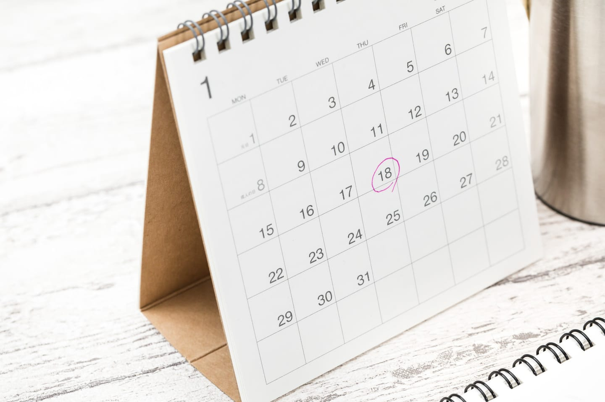
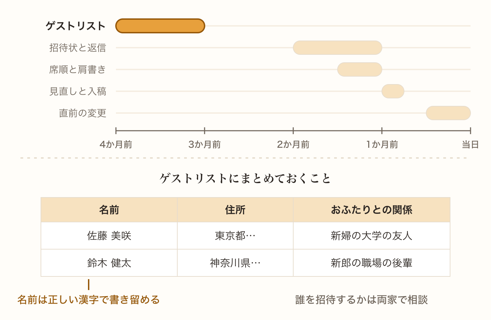
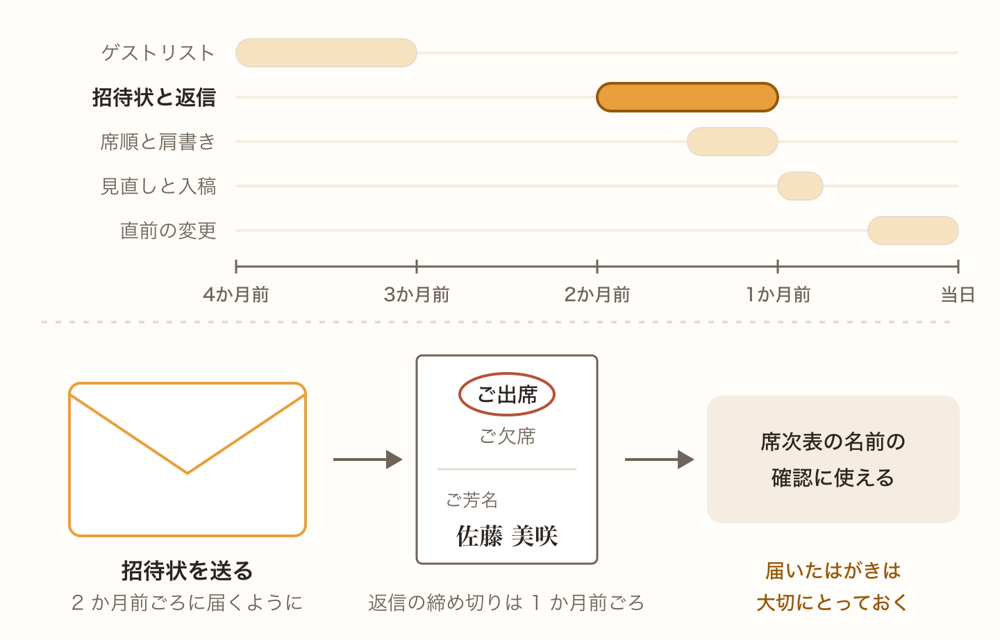
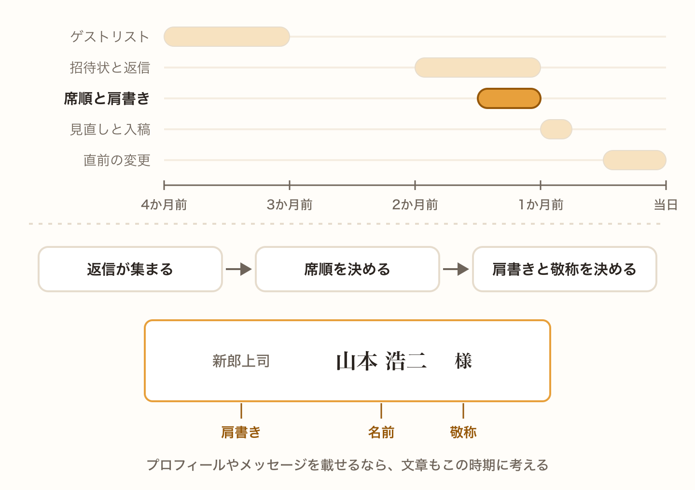
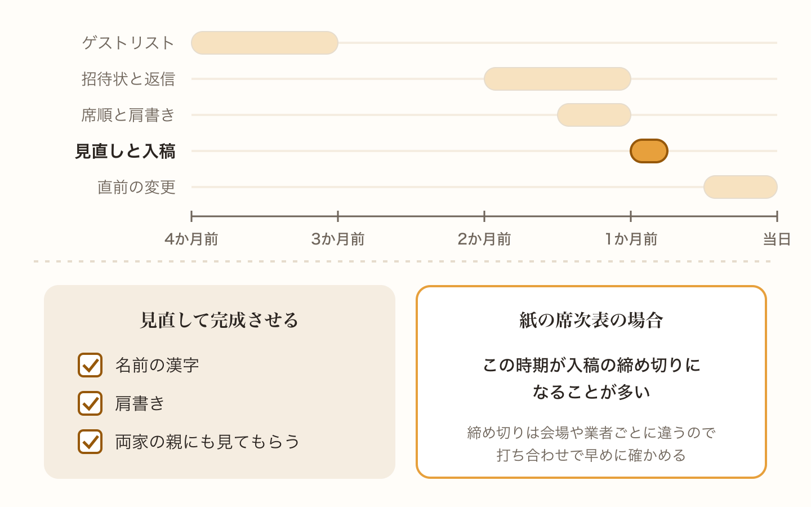
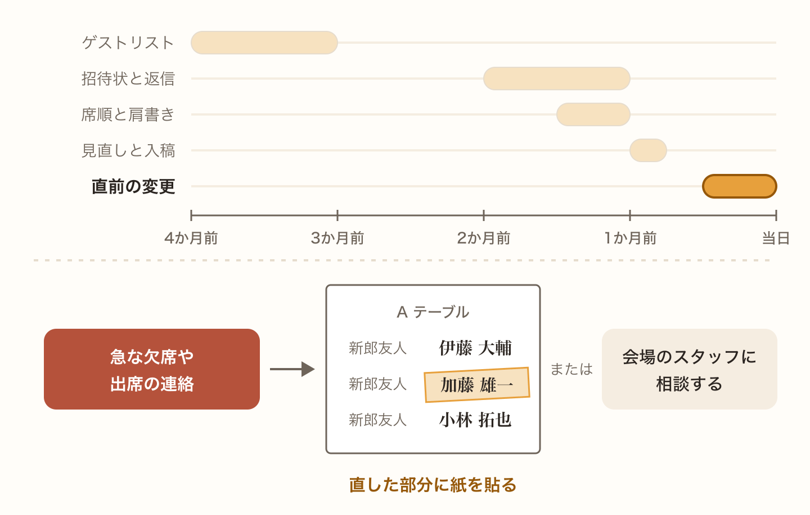
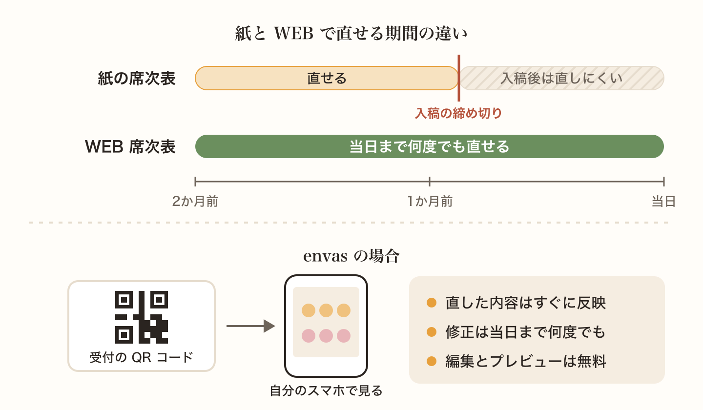

席次表は、結婚式の準備の中でも後半に作るものです。ただ、ゲストリストや招待状と深くつながっているので、気づいたときには締め切りが迫っていた、ということも少なくありません。

この記事では、結婚式の数か月前から当日までの流れに沿って、席次表の準備で何をすればいいかを紹介します。

## 3 か月から 4 か月前 ゲストリストを作る

席次表の準備は、ゲストリストづくりから始まります。誰を招待するかを両家で相談しながら決めて、名前や住所をまとめていきましょう。

この段階で、名前の正しい漢字や、おふたりとの関係も一緒に書き留めておくと、あとで肩書きを考えるときに困りません。

## 2 か月前 招待状を送る

招待状は、結婚式の 2 か月前ごろに届くように送るのが一般的です。返信の締め切りは、1 か月前くらいに設定することが多いです。

返信はがきには、ゲストが名前を書いてくれます。席次表に載せる名前の確認にも使えるので、届いたものは大切にとっておきましょう。

## 1 か月半前から 1 か月前 席順と肩書きを決める

返信が集まってきたら、いよいよ席次表づくりの本番です。出席してくれるゲストをテーブルに振り分けて、席順を決めていきます。

あわせて、ひとりひとりの肩書きと敬称も決めていきます。それぞれの考え方は、こちらの記事を参考にしてください。

[結婚式の席順はどう決める？上座と下座の基本とテーブル分けのコツ](/articles/2026-10-07-seating-order/)

[席次表の肩書きの書き方 上司や友人、親族ごとの例と迷いやすいケース](/articles/2026-10-07-seating-chart-titles/)

[席次表の敬称は「様」が基本 子どもや家族の書き方もあわせて解説](/articles/2026-10-07-seating-chart-honorifics/)

席次表に、おふたりのプロフィールやメッセージを載せる場合は、この時期に文章も考えておきましょう。

## 1 か月前から 3 週間前 見直して完成させる

席順と肩書きが決まったら、間違いがないかをしっかり見直します。名前の漢字や肩書きの間違いは、ゲストにとってうれしくないものです。できれば両家の親にも見てもらいましょう。

紙の席次表を会場や印刷業者にお願いする場合は、この時期が入稿の締め切りになることが多いです。締め切りは会場や業者によって違うので、打ち合わせのときに早めに確認しておきましょう。手作りする場合も、印刷と折り作業の時間を見込んでおく必要があります。

## 2 週間前から当日 直前の変更に対応する

結婚式が近づくと、急な欠席や出席の連絡が入ることがあります。紙の席次表は印刷が終わると直すのが難しいので、修正した部分に紙を貼ったり、会場のスタッフに相談したりして対応することになります。

## 直前まで直せる WEB 席次表という選択肢

ここまで見てきたとおり、紙の席次表は入稿の締め切りから逆算して準備を進める必要があります。一方で WEB 席次表なら、印刷の締め切りがありません。

envas では、ゲストは受付に置いた QR コードを読み取って、自分のスマートフォンで席次表を見ます。修正は結婚式の当日まで何度でもでき、直した内容はすぐに反映されます。席次表の編集とプレビューは無料なので、まずは試しに作ってみるのもおすすめです。

[https://envas.jp/](https://envas.jp/)
