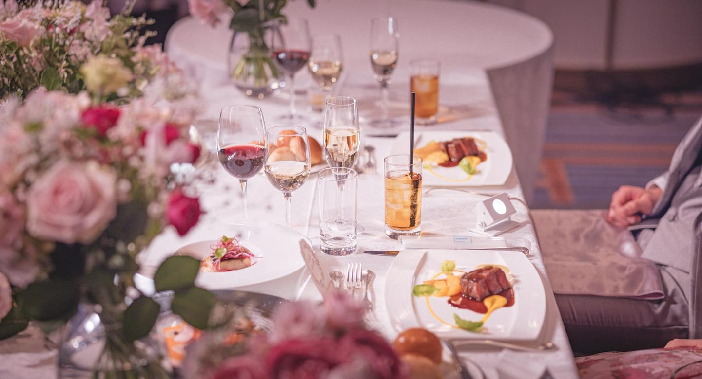
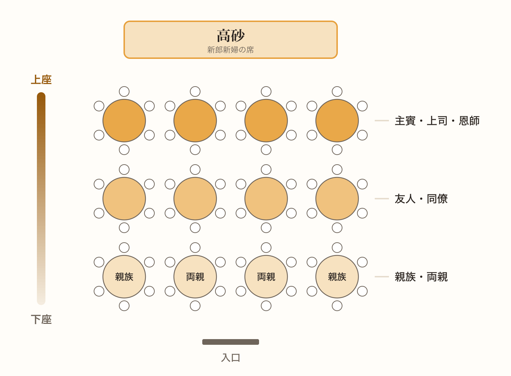
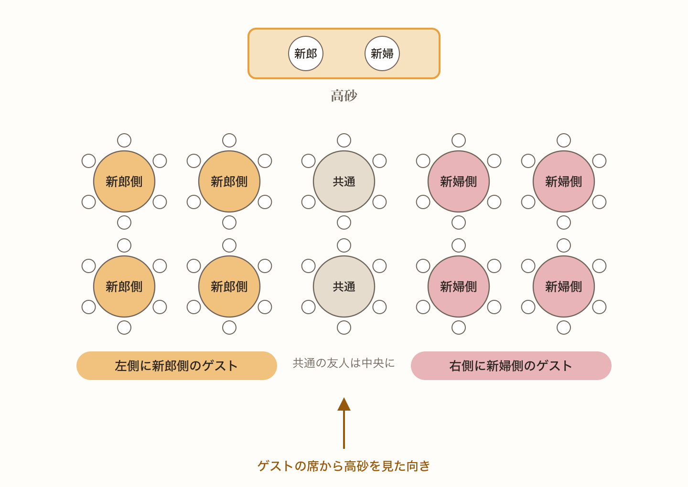
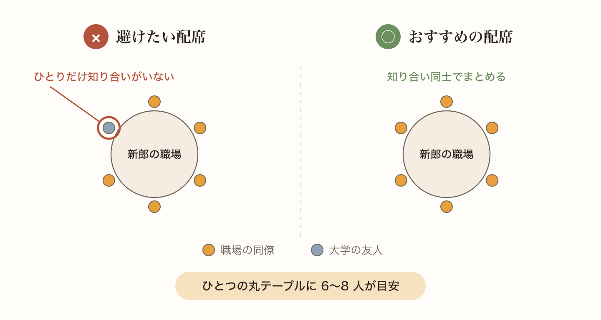
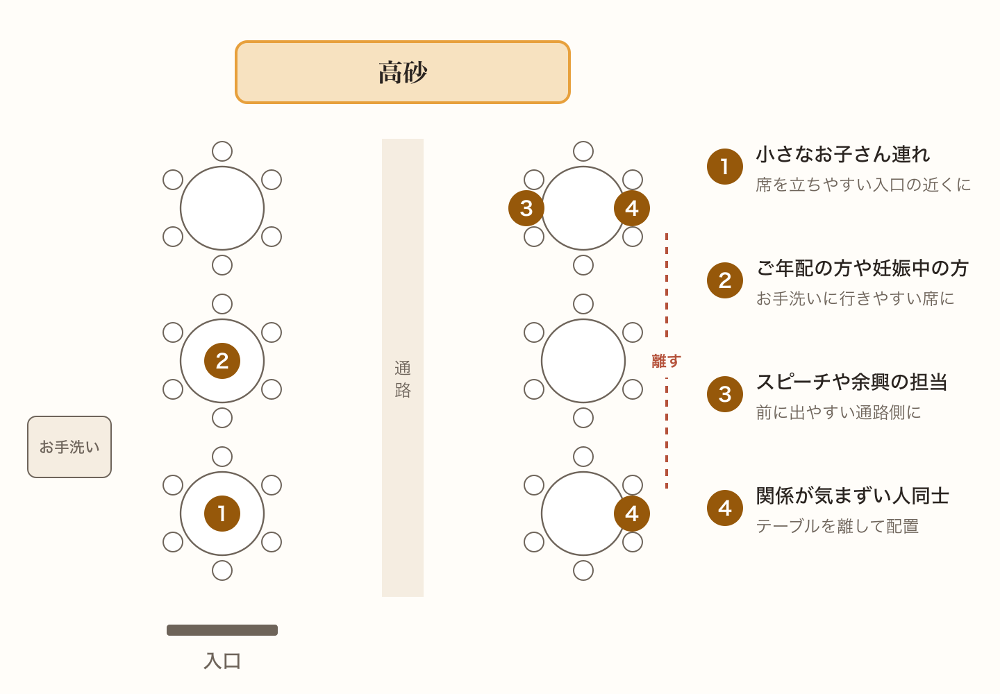
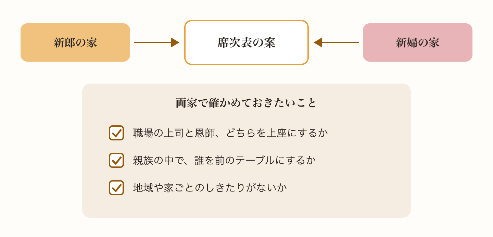
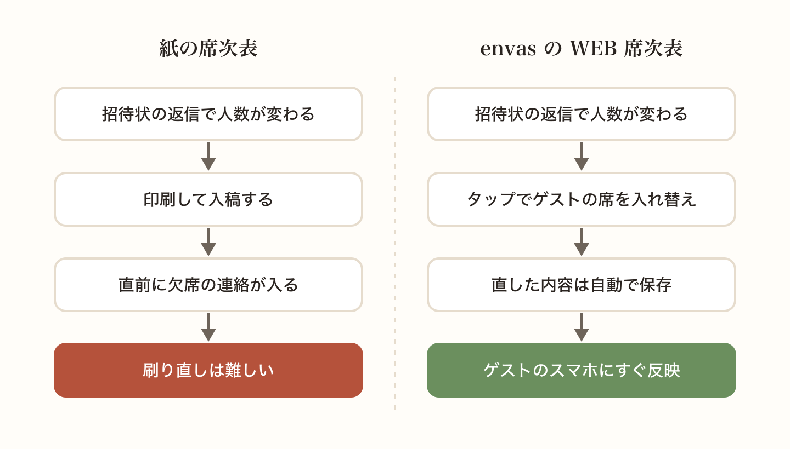

席次表の準備で、多くのおふたりが手を止めてしまうのが席順です。誰をどこに座らせるかで、ゲストの居心地も、当日の雰囲気も変わります。

とはいえ、基本の考え方さえ押さえておけば、あとはパズルのように当てはめていくだけです。この記事では、席順を決めるときの順番に沿って説明していきます。

## まずは上座と下座を知っておく

披露宴の会場では、新郎新婦が座る高砂にいちばん近い席が上座です。そこから離れて、入口に近づくほど下座になります。

上座に座っていただくのは、主賓や職場の上司、恩師といった、おふたりがお招きした目上の方です。真ん中あたりに友人や同僚が入り、入口に近い下座には親族が座ります。

両親がいちばん下座に座るのは、ゲストをお迎えする側だからです。最初は少し不思議に感じるかもしれませんが、おふたりと両家はゲストをもてなす側だと考えると、納得できると思います。

## 新郎側と新婦側で左右を分ける

会場から高砂を見て、左側を新郎側、右側を新婦側にするのが一般的です。新郎側のゲストは左のテーブルに、新婦側のゲストは右のテーブルにまとめていきます。

どちらかのゲストが多くて左右のバランスが崩れるときは、無理に分けなくても大丈夫です。共通の友人のテーブルを真ん中に置いたり、人数の多いほうのテーブルを少し反対側に寄せたりして調整しましょう。

## テーブルは関係ごとにまとめる

テーブル分けは、職場、学生時代の友人、親族のように、知り合い同士でまとめるのが基本です。ひとつの丸テーブルには 6 人から 8 人ほど座ることが多いので、グループの人数を見ながら振り分けていきます。

ここでいちばん気をつけたいのが、ひとりだけ知り合いのいないゲストをつくらないことです。人数の都合でどうしても混ぜるときは、話題の合いそうな人や年齢の近い人と同じテーブルにすると、当日も過ごしやすくなります。

## ゲストに合わせた気配りも忘れずに

席順は上座と下座だけで決まるものではありません。次のようなゲストには、少しだけ配慮しておくと安心です。

- 小さなお子さん連れのゲストは、途中で席を立ちやすい入口の近くに
- ご年配の方や妊娠中の方は、お手洗いに行きやすい席に
- スピーチや余興をお願いしている方は、前に出やすい通路側に
- 関係が気まずい人同士は、近くのテーブルにならないように

## 迷ったら両家で相談する

職場の上司と恩師のどちらを上座にするか、親族の中で誰を前にするか。こうした細かい順番は、地域や家ごとに考え方が違うこともあります。

迷ったときは、おふたりだけで決めずに両家の親にも見てもらいましょう。当日になって「この席順はちょっと…」とならないよう、早めに共有しておくのがおすすめです。

## 席順は何度でも組み替えられるように

招待状の返信が届くたびに人数が変わり、そのたびに席順を組み直すことになります。直前の欠席で席替えが必要になることも珍しくありません。

WEB 席次表の envas なら、ゲストをタップしてテーブルをタップするだけで席を動かせます。修正は何度でもでき、公開したあとに直した内容もそのままゲストのスマートフォンに反映されます。紙のように刷り直す必要がないので、直前の席替えにも慌てずに対応できます。

席次表の作り方はヘルプページで紹介しています。

[https://help.envas.jp/seating-chart/](https://help.envas.jp/seating-chart/)
