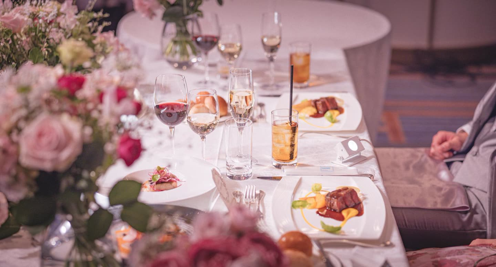
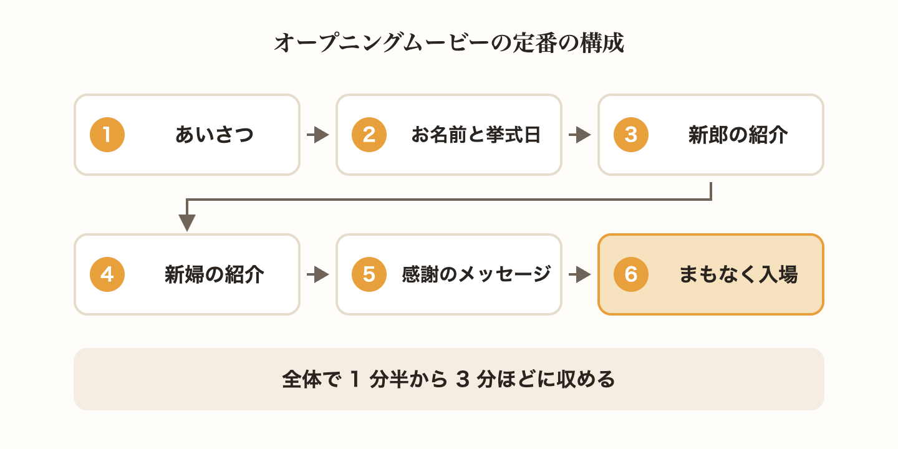
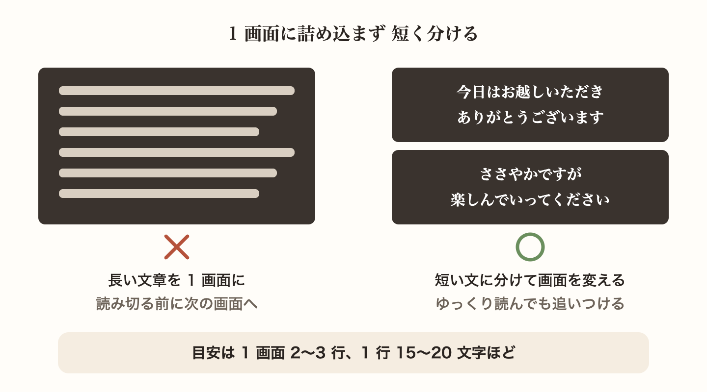
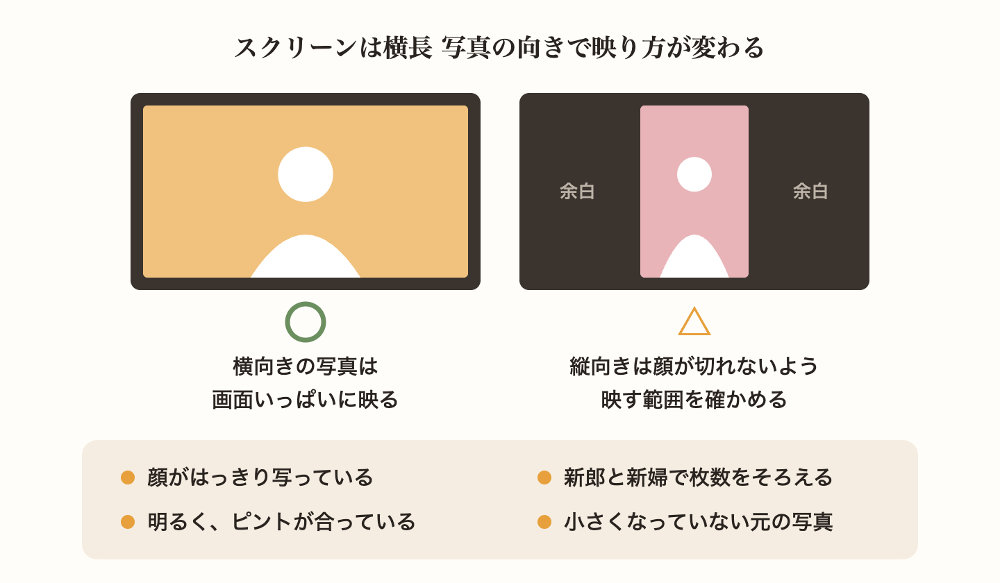
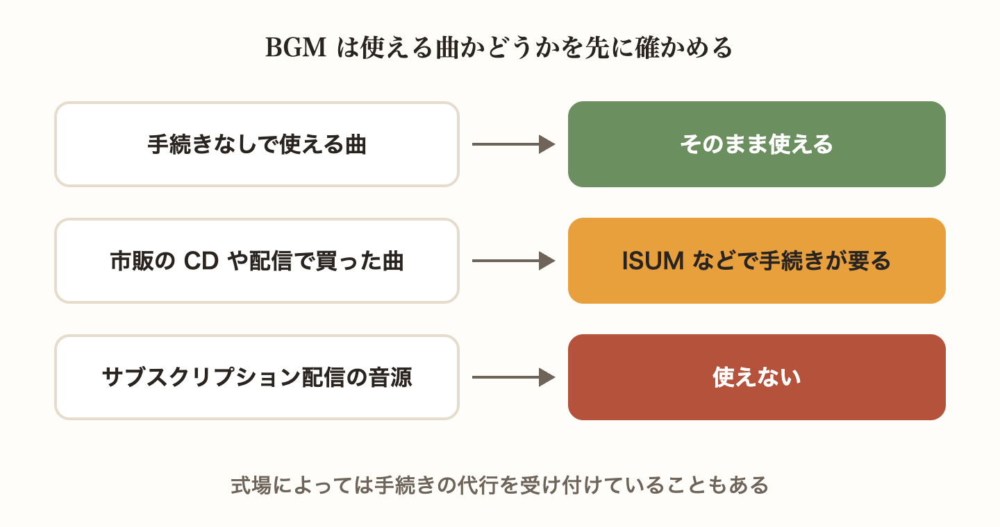
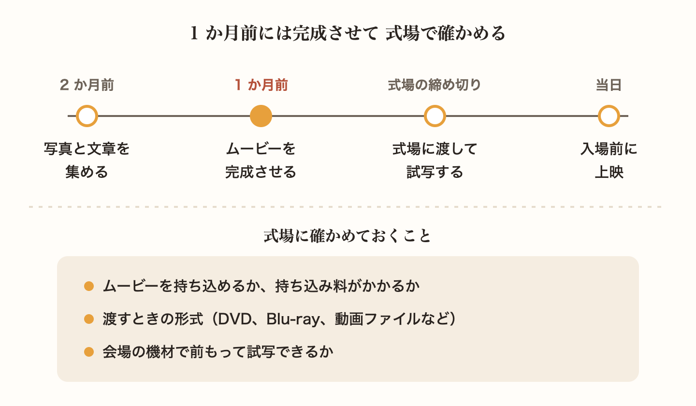
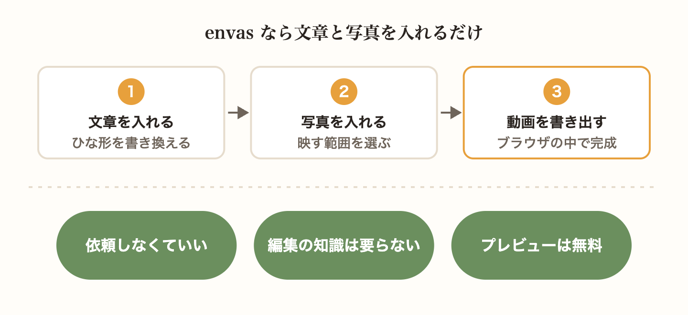

披露宴の始まりに流れるオープニングムービーは、おふたりの入場を待つゲストに「いよいよ始まる」と感じてもらうための映像です。短い映像ですが、何を入れればいいのか、どこまで凝ればいいのかで迷うおふたりも多いと思います。

この記事では、オープニングムービーの定番の構成と、文章や写真、BGM を選ぶときのポイント、上映までに確かめておきたいことを紹介します。

## 長さは 1 分半から 3 分ほど 定番の構成を押さえる

オープニングムービーは、ゲストが席に着いてから、おふたりが入場するまでのあいだに流します。長すぎるとゲストが待ちくたびれてしまうので、1 分半から 3 分ほどに収めるのが目安です。

構成に決まりはありませんが、次の流れがよく使われます。

- ゲストへのあいさつ
- おふたりのお名前と挙式日
- 新郎の紹介
- 新婦の紹介
- ゲストへの感謝のメッセージ
- まもなく入場することの案内

最後に入場の案内を入れておくと、ゲストの目が自然と入口に向き、そのまま拍手でおふたりを迎えてもらえます。

## 文章は短く ゲストが読み切れる量にする

ムービーの文章は、画面に出ている数秒のあいだに読み切れる量にします。1 画面に 2〜3 行、1 行 15〜20 文字ほどを目安にすると、ゆっくり読む方も追いつけます。長い文章を 1 画面に詰め込むより、短い文に分けて画面を変えるほうが読みやすくなります。

新郎と新婦の紹介文は、出身地や趣味、仕事など、ゲストが「そうなんだ」と思えることを 1 つか 2 つ選ぶくらいがちょうどよい量です。友人どうしでしか通じない話は、親族や職場の方には伝わりません。どのゲストが読んでもわかる内容にしましょう。

結婚式では、別れや繰り返しを連想させる言葉を避ける習わしがあります。「別れる」「切れる」「終わる」「再び」「重ね重ね」などは、ほかの言い方に替えておくと安心です。

## 写真は横向きで明るいものを選ぶ

会場のスクリーンは横長なので、横向きの写真のほうが画面いっぱいに映ります。縦向きの写真を使うときは、顔が切れないように、映す範囲を確かめておきましょう。

写真を選ぶときは、次のことを確かめます。

- 顔がはっきり写っている
- 明るく、ピントが合っている
- 新郎と新婦で枚数がそろっている

スマートフォンの画面ではきれいに見える写真も、大きなスクリーンに映すと粗さが目立つことがあります。SNS に上げた写真や、メッセージアプリで受け取った写真は小さくなっていることが多いので、撮った方に元の写真を送ってもらえないか頼んでみるのがおすすめです。

## BGM は使える曲かどうかを先に確かめる

BGM は、ムービーの雰囲気を大きく左右します。入場前の盛り上げには、明るくテンポのよい曲が選ばれることが多いです。

気をつけたいのが著作権です。市販の CD や配信で買った曲をムービーに入れて披露宴で流すには、作詞・作曲の権利と、録音した音源の権利の両方について手続きが必要になります。結婚式の映像向けには、ISUM（一般社団法人 音楽特定利用促進機構）を通じて手続きする方法があります。式場によっては手続きの代行を受け付けていることもあるので、打ち合わせのときに聞いてみましょう。

Apple Music や Spotify などのサブスクリプション配信の音源は、ムービーには使えません。曲を決める前に、使える曲かどうかを確かめておくと、あとで選び直さずに済みます。

## 1 か月前には完成させて 式場で確かめる

ムービーを式場に渡す締め切りは式場によって違いますが、結婚式の 2 週間から 1 か月前ほどに設けられていることが多いです。直す時間も考えて、1 か月前には完成させておくと安心です。

あわせて、次のことを式場に確かめておきましょう。

- ムービーを持ち込めるか、持ち込み料がかかるか
- 渡すときの形式（DVD、Blu-ray、動画ファイルなど）
- 会場の機材で前もって試写できるか

パソコンでは問題なく再生できても、会場の機材では映り方が違ったり、再生できなかったりすることがあります。試写ができるなら、早めにお願いしておきましょう。

## envas なら文章と写真を入れるだけで作れる

ここまでのポイントを押さえれば、オープニングムービーはおふたりでも十分に作れます。とはいえ、動画編集のソフトを一から覚えるのは大変です。

envas のオープニングムービーなら、ひな形の文章を書き換えて写真を入れるだけで、ブラウザの中でムービーができあがります。あいさつから「まもなく入場」までの構成と画面の動きは用意してあるので、誰かに依頼する必要も、動画編集の知識も要りません。入力欄の下には行数と文字数が表示されるので、文章の長さも確かめながら書けます。BGM には、著作権の手続きなしで使える曲も用意しています。

作成とプレビュー、透かし入りの動画の書き出しは無料です。仕上がりに満足できたら、5,500 円（税込）の透かし解除をご購入いただくと、透かしのない動画を書き出せます。

[https://help.envas.jp/opening-movie/](https://help.envas.jp/opening-movie/)

自分たちで作ってみたものの納得のいく仕上がりにならない、もっと凝った演出にしたい、というときは、プロに任せるのもひとつの方法です。envas の姉妹サービスの WEDDING WISH では、オープニングムービーやプロフィールムービーの制作を承っています。envas をご利用の方限定のクーポンコードを、envas にログインしたあとのダッシュボードでご案内しています。ご注文の前に確かめてみてください。

[WEDDING WISH（ウェディングウィッシュ）](https://weddingvideowish.com/)
