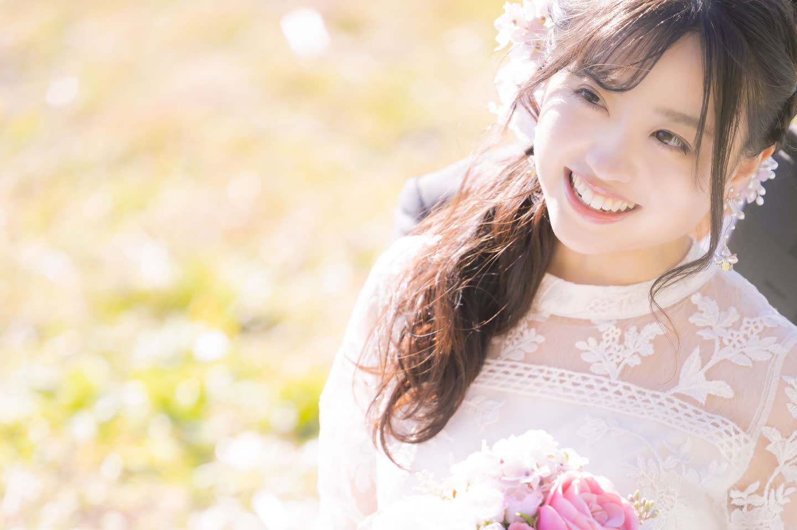
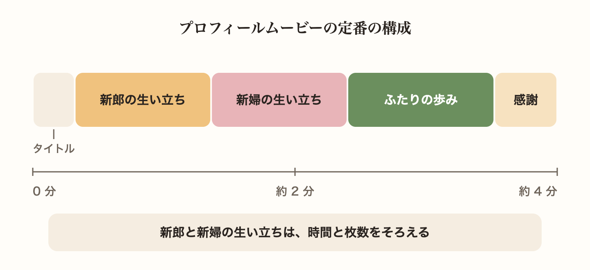
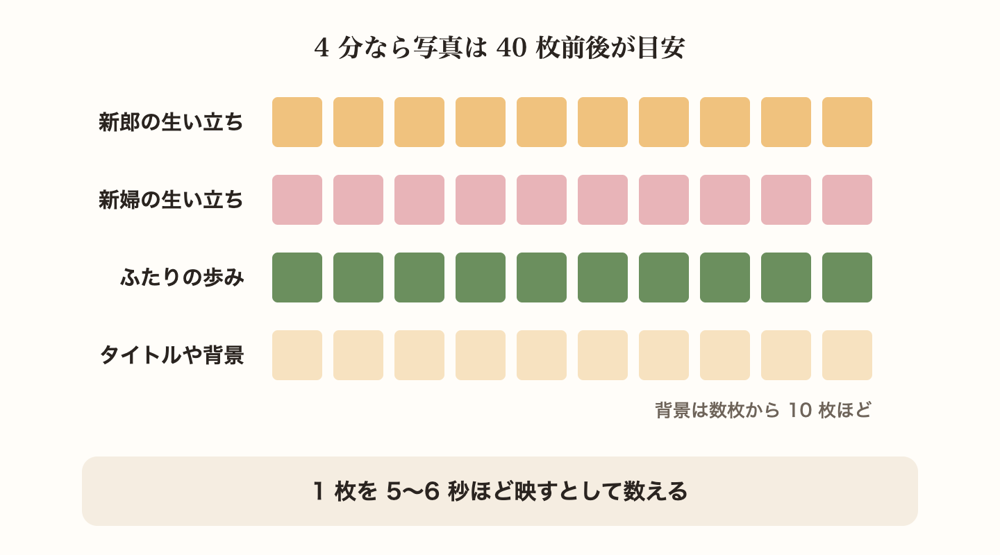
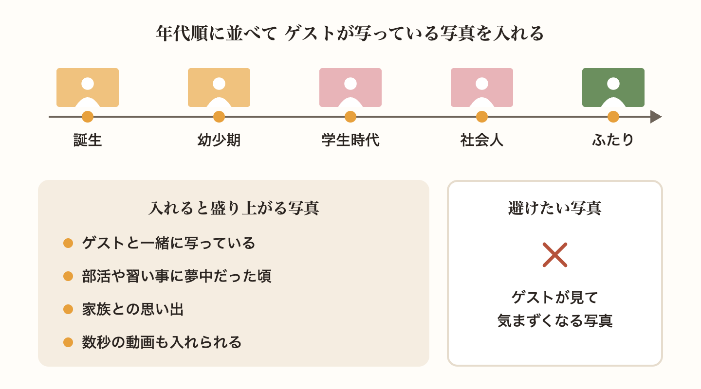
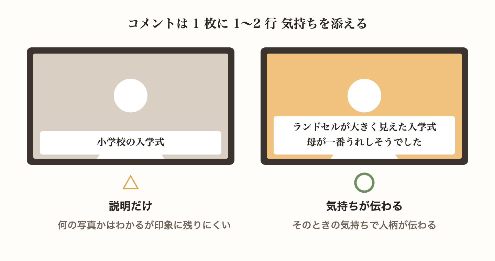
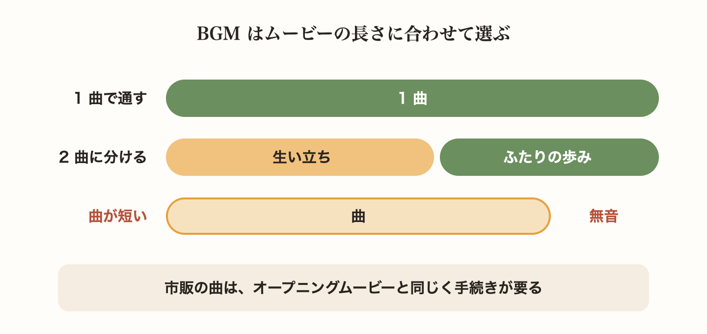
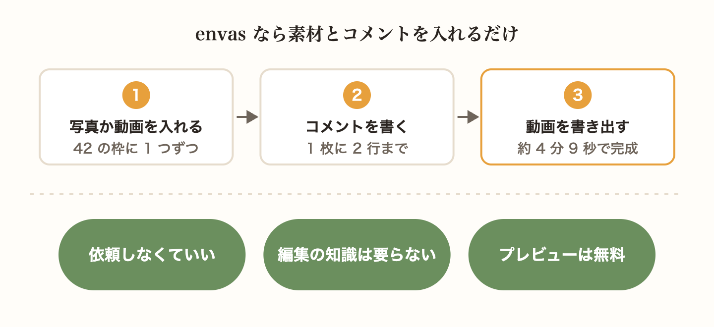

プロフィールムービーは、おふたりがどんなふうに育ち、どうやって出会ったのかをゲストに紹介する映像です。お色直しの中座のあいだなどに流れることが多く、ゲストが楽しみにしている時間のひとつです。

一方で、子どもの頃の写真を集めたり、1 枚ずつコメントを考えたりと、思っている以上に時間がかかる準備でもあります。この記事では、プロフィールムービーの定番の構成と、写真の集め方や選び方、コメントと BGM のポイントを紹介します。

## 長さは 4 分前後 定番の構成を押さえる

プロフィールムービーは、3 分から 5 分ほどの長さが目安です。長くなるほどゲストの集中が続きにくくなるので、伝えたいことを絞って 4 分前後に収めるとまとまりがよくなります。

構成に決まりはありませんが、次の流れがよく使われます。

- おふたりの名前を出すタイトル
- 新郎の生い立ち
- 新婦の生い立ち
- 出会いから今日までのふたりの歩み
- ゲストへの感謝のメッセージ

新郎と新婦の生い立ちは、時間と写真の枚数をそろえておくと、どちらかに偏った印象になりません。

## 写真は 40 枚前後を目安に早めに集める

写真の枚数は、1 枚を 5〜6 秒ほど映すとして数えます。4 分のムービーなら 40 枚前後が目安です。新郎と新婦の生い立ち、ふたりの歩みにそれぞれ 10 枚ほど、残りをタイトルや背景に使うと考えると集めやすくなります。

子どもの頃の写真は、実家のアルバムにしかないことがよくあります。帰省のときにしか探せないこともあるので、ムービーを作ると決めたら、早めに家族に声をかけておきましょう。

紙の写真は、スキャナーで読み込むか、スマートフォンのスキャン用のアプリで撮るとデータにできます。そのまま撮るときは、照明が写り込まないように、明るい場所で真上から撮るのがコツです。

## 写真は年代順に ゲストが写っているものを入れる

生い立ちの写真は、生まれた頃から今に向かって年代順に並べると、ゲストが流れを追いやすくなります。

次のような写真を入れると、会場が盛り上がります。

- 会場に来ているゲストと一緒に写っている写真
- 部活や習い事など、その頃に夢中だったことがわかる写真
- 家族旅行や行事など、家族との思い出の写真

ゲストは、自分が写っている写真が映るとうれしいものです。友人や親族、職場の方など、招待している方との写真を年代ごとに探してみてください。反対に、ゲストが見て気まずくなるような写真は避けておきましょう。

写真だけでなく、短い動画を入れるとムービーに動きが出ます。子どもの頃のホームビデオや、ふたりで出かけた先で撮った動画を数秒ずつ入れるのもおすすめです。

## コメントは 1 枚に 1〜2 行 気持ちを添える

写真に添えるコメントは、1 枚あたり 1〜2 行に収めます。写真が映っている数秒のあいだに、写真と文字の両方を見てもらう必要があるためです。

コメントには、写真の説明よりも、そのときの気持ちや家族とのエピソードを短く書くと、おふたりの人柄が伝わります。たとえば「小学校の入学式」とだけ書くより、「ランドセルが大きく見えた入学式 母が一番うれしそうでした」と書くほうが、見ているゲストの心に残ります。

友人どうしでしか通じない話は、親族や職場の方には伝わりません。また、結婚式では「別れる」「切れる」「終わる」「再び」のような、別れや繰り返しを連想させる言葉を避ける習わしがあります。名前や年号に間違いがないかも含めて、できあがったら家族にも見てもらうと安心です。

## BGM はムービーの長さに合わせて選ぶ

4 分前後のムービーなら、1 曲を通して流すか、生い立ちとふたりの歩みで 2 曲に分けるのがよくある選び方です。しっとりした曲なら懐かしい雰囲気に、明るい曲なら楽しい雰囲気になります。

曲がムービーより短いと、最後が無音になってしまいます。曲を選ぶときは、長さも確かめておきましょう。

市販の曲を流すには、オープニングムービーと同じく著作権の手続きが必要です。手続きの考え方は、こちらの記事で紹介しています。

[オープニングムービーの作り方 構成と文章、写真や BGM 選びのコツ](/articles/2026-10-11-opening-movie-tips/)

## envas なら写真とコメントを入れるだけで作れる

写真やコメントがそろっても、それを 1 本のムービーにまとめるには、動画編集のソフトで写真を並べ、文字を入れ、曲に合わせていく作業が待っています。

envas のプロフィールムービーなら、生い立ちやふたりの歩みの枠に写真や動画を入れて、コメントを書くだけで、約 4 分 9 秒のムービーがブラウザの中でできあがります。画面の切り替えや文字の動きは用意してあるので、誰かに依頼する必要も、動画編集の知識も要りません。動画は使い始める場面を選んで入れられ、写真が足りないときは同じ写真を別の枠に使うこともできます。BGM には、最後まで流れる、著作権の手続きなしで使える曲も用意しています。

作成とプレビュー、透かし入りの動画の書き出しは無料です。仕上がりに満足できたら、9,800 円（税込）の透かし解除をご購入いただくと、透かしのない動画を書き出せます。オープニングムービーの透かし解除とは別のご購入です。

[https://help.envas.jp/profile-movie/](https://help.envas.jp/profile-movie/)

自分たちで作ってみたものの納得のいく仕上がりにならない、もっと凝った演出にしたい、というときは、プロに任せるのもひとつの方法です。envas の姉妹サービスの WEDDING WISH では、プロフィールムービーやオープニングムービーの制作を承っています。envas をご利用の方限定のクーポンコードを、envas にログインしたあとのダッシュボードでご案内しています。ご注文の前に確かめてみてください。

[WEDDING WISH（ウェディングウィッシュ）](https://weddingvideowish.com/)
